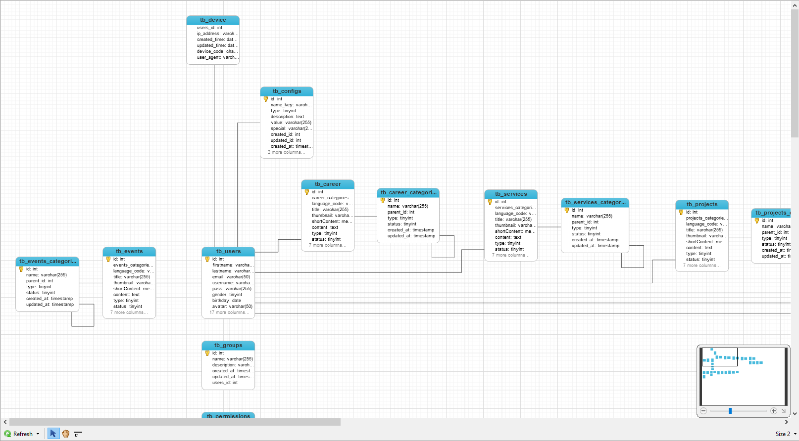

# Database_core

## Mục đích:

để lưu lại cáu trúc core database đã xây dựng cho các project sau.
với yếu tố chính là việc phân chia các requirement thành các bảng chuyên biệt càng nhỏ càng tốt, phục vụ chính cho tốc độ của query < 0.3s với tối đa là 2 million recods in slect query.

phục vụ chính cho các app react native và web do đã chia các chức năng chính nên control dễ hơn và việc mở rộng hoặc thu hẹp phạm vi của app, web trở nên đơn giản và đễ dàng hơn.

## Cách làm chính trong db này:

Phân chia db thành các cụm nhỏ có quan hệ với nhau với các cụm chính như sau:

```
├───tb_users
|  ├───tb_configs
|  ├───tb_device
|  ├───tb_events
|  |   └───tb_events_categories
|  ├───tb_career
|  |   └───tb_career_categories
|  ├───tb_services
|  |   └───tb_services_categories
|  ├───tb_projects
|  |   └───tb_projects_categories
|  ├───tb_posts
|  |   └───tb_posts_categories
|  ├───tb_pages
|  |   └───tb_pages_categories
|  ├───tb_orders
|  |   └───tb_orders_products
|  |       └───tb_products
|  |           └───tb_products_categories
|  └───tb_groups
|       └───tb_permissions
            └───tb_list_permissions
// Ngoài ra còn các cụm chức năng riêng biệt như location bao gồm thành phố, xã, quận, huyện:

| tb_country

tb_location_district
└───tb_city
    └───tb_ward

tb_district
└───tb_province
    └───tb_xaphuong

// Các menu chứng năng của hệ thống phục vụ cho việc thay đổi các hệ thống khác nhau thì chỉ cần thay data trong DB

| tb_system_menus
| tb_menus

// thư việc các tài nguyên như ảnh video file đính kèm

tb_library
└───tb_library_categories

// bảng log bug hệ thống và các hành động của actor trong hệ thống cũng cần phải lưu lại:

| tb_log_actions

```

<div style="display: flex; justify-content: center;">
  
</div>

</br></br></br>

## Còn đây là database cho Chat

với cách phân chia chính như sau là:

- tb_user thông tin người dùng tài khoản
- tb_chat_info thông tin nhóm chat bao gồm các chức năng avatar và các tài nguyên của nhóm, các thông tin, ...
- tb_chat_groups chứa các thông tin của một nhóm chat có thể là 1: 1 hay n:n
- tb_chat-conversation_users_is_chat_groups_id với mỗi nhóm chat ta lại có một cuộc hội thoại chứa các tin nhắn trong nhóm.

#### lợi thế:

việc làm theo cách này là tối ưu được cách tổ chức dữ liệu phục vụ cho việc truy xuất như select và update hay searching các tin nhắn

#### nhược điểm:

khi tạo ra nội dung lớn với số lượng người dùng lớn thì phình to DB do tạo thêm nhiều các bảng tb_chat-conversation do đó khó cho việc kiểm xoát db và transform data sang một db khác vì quá nhiều bảng, ví dụ hệ thống có 1000 người dùng chat liên tục khi đó maximum table conversation tạo ra sẽ là 1000 \* 1000 = 1 triệu bảng khi đó việc kiểm xoát các table sẽ rất khó khăn. bù lại mình tăng tốc được tốc đọ truy vấn và tìm kiếm khi muốn search lại các nội dung hội thoại do mỗi bảng sẽ hoạt động tốt trong khoảng 2 triệu bản nghi.

còn cách khác là khi một user tạo một conversation thì ta mới tạo một bảng tb_conversation_users_id và cứ người nào chat với thì sẽ lưu lại id của người chat cùng --> trong trường hợp này thì tốc độ của người dùng ban đầu là như nhau và theo thời gian ai tạo cuộc hội thoại càng nhiều thì càng tạo ra nhiều data làm cho việc truy vấn chậm lại.

cũng có thể dùng thuật toán làm tăng hiệu năng của app nhưng bản chất vẫn là do việc tổ chức và phân tích database làm bên tốc độ cuối cũng của app

tham khảo ảnh sau

<div style="display: flex; justify-content: center;">
  
</div>
